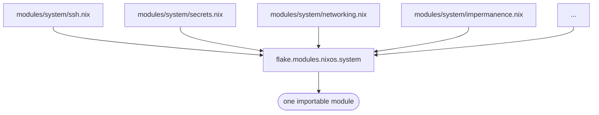
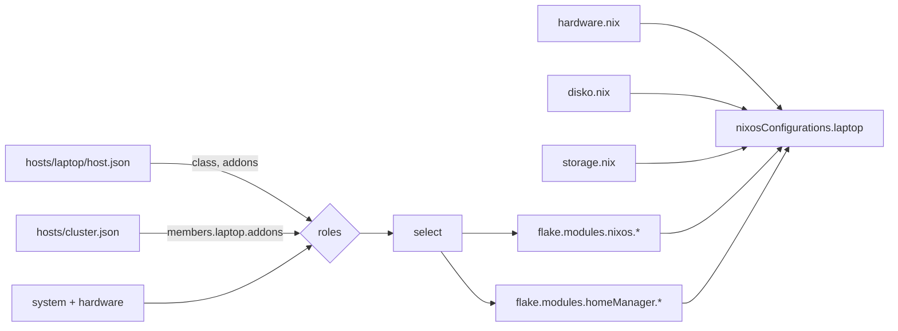

# Architecture

## One bundle, many files

[`import-tree`](https://github.com/denful/import-tree) imports every `.nix`
file under `modules/`, recursively.

[`flake-parts`](https://flake.parts/)' `modules` flakeModule declares
`flake.modules.<class>.<name>` as a **deferred module**: identical namespaces
merge.

```nix
flake.modules.nixos.system = { ... };
```

Every file declaring that namespace contributes to one importable module. Each
file declares one concern.



## Bundles

A **bundle** is a top-level directory under `modules/`. Files inside it declare
into `flake.modules.<class>.<that name>`.

- Subdirectories and file splits are organization.
  `modules/desktop/browser/` declares into `flake.modules.homeManager.desktop`.
- `<class>` is `nixos` or `homeManager`. Both use the same bundle names, so a
  bundle can have a system half and a user half. A host gets whichever exist.

## How a host declares itself

A host is a directory under `hosts/` containing `host.json`. It declares what it
*is*, not which files to import.

| Source | Meaning |
|---|---|
| always | `system` and `hardware` |
| `host.class` | exactly one of `desktop` or `server` |
| `host.addons` | capabilities affecting only this machine, e.g. `dev` |
| `cluster.json` → `members.<host>.addons` | jobs this host performs *for the cluster*, e.g. `gateway` |

See [`hosts.md`](hosts.md) for the schema.

## Assembly

[`lib/mkHost.nix`](../lib/mkHost.nix) takes a host *name* and produces one
`nixosConfigurations` entry.



Only four paths are imported directly:

- `hardware.nix`
- `disko.nix`
- `storage.nix` (optional)
- `home/` (optional, desktop only)

A role that exists in neither class is a `throw` naming it.

### specialArgs

| Arg | Contents                                                           |
|---|--------------------------------------------------------------------|
| `host` | `host.json`'s `host` block, plus `name` derived from the directory |
| `user`, `hardware`, `locale`, `flake` | the matching blocks of `host.json`                                 |
| `cluster` | all of `cluster.json`, or left empty if absent                     |
| `inputs` | the flake inputs                                                   |

`host.name` comes from the directory name. It is not stored in `host.json`.

## Evaluation scopes

| Scope | Position | Has | Holds |
|---|---|---|---|
| outer `let` | flake-parts level, outside the module function | nothing host-specific, evaluated once | pure helpers, constants, anything shared between the `nixos` and `homeManager` halves |
| inner `let` | inside the module function | `config`, `pkgs`, specialArgs | anything derived from the host being built |