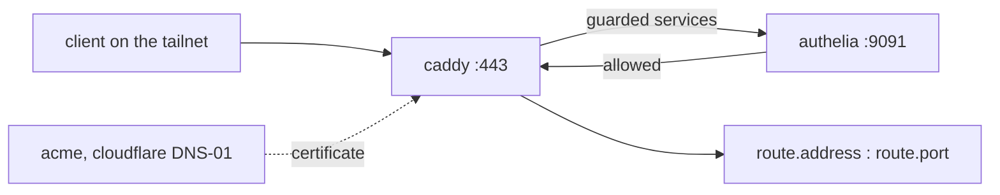

# gateway

The host that fronts the cluster: TLS, authentication, DNS. Assigned through
`cluster.json` → `members.<host>.addons`.

Everything here keys off `cluster.domain`.

## Request path

A vhost exists for every service whose descriptor has a non-null `route`.

## Proxy

caddy, with `auto_https disable_certs`. Certificates come from ACME. Every
vhost names its certificate files explicitly.

| Piece | Value |
|---|---|
| vhost | `<route.subdomain>.<domain>` |
| upstream | `reverse_proxy <route.address>:<route.port>` |
| certificate | `/var/lib/acme/<domain>/{fullchain,key}.pem`, wildcard |
| issuance | ACME DNS-01 via cloudflare, token from `sops` |
| catch-all | `*.<domain>` serves the cert then `aborts` |
| firewall | 80 and 443, tailscale interface only |

A subdomain with no vhost hits the catch-all and gets a connection reset.

## Authentication

authelia, reached by caddy through `forward_auth` on `127.0.0.1:9091`.

A service is **guarded** when its descriptor says all three:

- `route` is not null
- `hasAuth` is false
- `access` is not `"open"`

Guarded services get a `forward_auth` block in their vhost and a rule in
authelia's access control. Everything else is proxied straight through.

`access` maps to authelia's vocabulary:

| `route.access` | authelia policy |
|---|---|
| `open` | `bypass` |
| `1fa` | `one_factor` |
| `2fa` | `two_factor` |
| `blocked` | `deny` |

`default_policy` is `deny`. A domain with no rule is refused. `route.groups`
becomes the rule's subject, defaulting to `admin`.

authelia publishes its own descriptor: port 9091, `access = "open"`,
`hasAuth = true`. It gets a vhost at `auth.<domain>` and is never asked to
authenticate itself.

### User database

authelia owns `users.yml` once it exists. `authelia-main-seed` is a oneshot. It
writes the file once, from a sops template built around `authelia/admin-hash`,
and does nothing on later boots. Changing the hash in `secrets.json` afterwards
has no effect. Change the password through authelia.

## DNS

AdGuard Home. Two listeners:

| Listener | Address | Purpose |
|---|---|---|
| web UI | `127.0.0.1:3000` | proxied and guarded like any other service |
| resolver | `0.0.0.0:53` | queries from the tailnet |

`mutableSettings = false`. nix owns `AdGuardHome.yaml` and the web UI cannot
change it. Filter rule counts and timestamps live in that same file and reset
to zero on every restart. The downloaded lists live under `data/filters/` and
are untouched.

`users = [ ]` disables AdGuard's own login. authelia guards the UI.

AdGuard runs under systemd's `DynamicUser`. Its state is at
`/var/lib/private/AdGuardHome`, and that is the path to persist.
