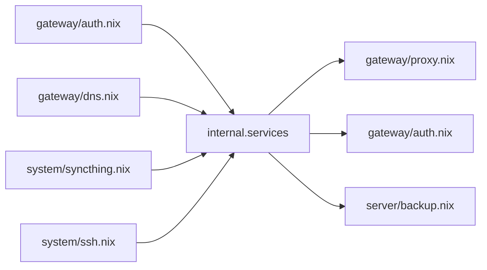

# server

Bundle for hosts with `class = "server"`.

## The service descriptor

`internal.services.<name>` is what a service offers the rest of the host.
Declared in [`services.nix`](../modules/server/services.nix). The option exists
only on a server.

One producer per service, any number of consumers. A producer sets its slice
unconditionally. A consumer works from an empty set.

### Fields

| Field | Default | Meaning |
|---|---|---|
| `route` | — | read by `gateway/proxy.nix`, `gateway/auth.nix` |
| `route.port` | — | required |
| `route.address` | `127.0.0.1` | upstream address |
| `route.subdomain` | the service name | vhost is `<subdomain>.<cluster.domain>` |
| `route.expose` | `private` | `private`, `tunnel`, `relay` |
| `route.access` | `1fa` | `open`, `1fa`, `2fa`, `blocked` |
| `route.hasAuth` | `false` | the service authenticates on its own |
| `route.groups` | `[ "admin" ]` | groups allowed through |
| `route.extraConfig` | `""` | appended to the caddy vhost |
| `metrics` | `null` | unused |
| `volumes` | `[ ]` | names from `cluster.json` `volumes` |
| `backup.paths` | `[ ]` | `server/backup.nix`; empty means not backed up |
| `backup.exclude` | `[ ]` | `server/backup.nix` |
| `notify` | `[ ]` | units that should report failure |

## Backup

restic. Targets come from the `backup.*` block of the host's `secrets.json`.
Each key is one repository. Paths come from every descriptor declaring
`backup.paths`.

| Secret | Purpose |
|---|---|
| `backup/<target>/password` | repository password |
| `backup/<target>/repository_unencrypted` | repository path or rclone URL |
| `backup/<target>/schedule_unencrypted` | systemd `OnCalendar` |
| `backup/<target>/env/<VAR>` | environment for the backend, e.g. rclone credentials |

## Storage

`disko.nix` describes the boot disk. `storage.nix` describes the rest and is
optional.

[`lib/mkBtrfsRaid.nix`](../lib/mkBtrfsRaid.nix) produces a
`disko.devices.disk` fragment for one multi-device btrfs filesystem. The array
is expressed the way `mkfs.btrfs` takes it:

- The **head** device carries the content and an `extraArgs` list naming the
  other devices.
- **Member** devices get a placeholder entry with an empty partition table.

| Argument | Default | Meaning |
|---|---|---|
| `name` | — | attribute name of the head disk, and the label |
| `devices` | — | head first, then members |
| `data` | `raid1` | `-d` profile |
| `metadata` | follows `data` | forced to `raid1` when `data` is `raid5`/`raid6` |
| `label` | `name` | filesystem label |
| `destroy` | `true` | passed through to disko |
| `content` | `{ }` | merged into the head disk's btrfs content |

The host does two things:

- Points the mounts at the label:
  `fileSystems."<mount>".device = lib.mkForce "/dev/disk/by-label/<label>"`.
- Keeps metadata off parity profiles.

## Disk health

| Service | Schedule |
|---|---|
| `btrfs.autoScrub` | monthly, deduplicated by device, one scrub per filesystem |
| `smartd` | short self-test nightly 05:00, long test Saturdays 06:00, mail daily |