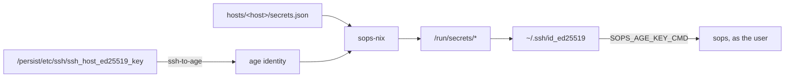

# system

Bundle every host imports, regardless of class.

## Secrets

Each host has one encrypted file, `hosts/<name>/secrets.json`, decrypted at
activation by [sops-nix](https://github.com/Mic92/sops-nix).



The host's ssh key is the age identity. No age key file is stored. The user's
private key is one of the secrets in the file, so decrypting the file produces
the key used to edit it.

- Host keys live at `${impermanence.root}/etc/ssh`. They survive the root
  rollback.
- `.sops.yaml` gives each host two recipients: the machine and the user.

### Shape without values

sops encrypts values, not keys. Parsing the encrypted file at eval time yields
the full key structure with unreadable values.

Three modules rely on this:

| Module | Reads | Decides |
|---|---|---|
| `networking.nix` | `wifi.*` | which profiles to generate |
| `vpn.nix` | `tailscale-authkey` | whether to enable tailscale at all |
| `server/backup.nix` | `backup.*` | which restic targets exist |

Fields whose name ends in `_unencrypted` keep their value readable, set by
`unencrypted_suffix` in `.sops.yaml`. They are for the places where eval needs
the value, not just the key.

### Secrets in use

| Key | Consumer |
|---|---|
| `user-password` | `user.nix`, `neededForUsers` |
| `user-privatekey` | `secrets.nix` → `~/.ssh/id_ed25519` |
| `tailscale-authkey` | `vpn.nix` |
| `wifi/<ssid>/<section>/<key>` | `networking.nix` |
| `backup/<target>/…` | `server/backup.nix` |
| `cloudflare-token` | `gateway/proxy.nix`, ACME DNS-01 |
| `authelia/{admin-hash,jwt,session,storage}` | `gateway/auth.nix` |

## Network profiles

Wi-Fi networks are declared only in `secrets.json`. The shape mirrors
NetworkManager's keyfile sections:

```
wifi.<ssid>.<section>.<key>
```

`<section>` is a literal keyfile section: `wifi`, `wifi-security`, `802-1x`.
`<key>` is its setting name. `networking.nix` turns each leaf into a sops
secret, an environment variable, and a `$VAR` reference inside
`networking.networkmanager.ensureProfiles`. sops renders one `wifi.env` at
activation. NetworkManager substitutes at profile-apply time.

```
wifi/cafe/wifi-security/psk   ->   WIFI_CAFE_WIFI_SECURITY_PSK
```

- Adding a network is a `secrets.json` edit.
- SSIDs are keys and end up in the nix store. Values do not.

## Impermanence

`/` is a btrfs subvolume recreated empty on every boot. State lives at
`internal.system.impermanence.root`, default `/persist`, bind-mounted back.

- The rollback is an initrd systemd unit, ordered before `sysroot.mount`.
- The outgoing root is moved to `old_roots/<timestamp>` on the top-level
  subvolume and deleted after 30 days.
- Requires `boot.initrd.systemd.enable`.

`old_roots` sits beside `root` in the top-level subvolume and is not visible
from `/`. Mount `subvol=/` to see it.

A module persists a path through the option:

```nix
internal.system.impermanence.directories = [ "/var/lib/foo" ];
internal.system.impermanence.files = [ "/etc/bar" ];
```

Entries may be a plain path or an attrset with `user`, `group` and `mode`.
Services using systemd's `DynamicUser` keep their state in `/var/lib/private/`
and are persisted there.

## SSH

| Setting | Value |
|---|---|
| host keys | `${impermanence.root}/etc/ssh` |
| known hosts | the common forges, plus every host in `hosts/` that declares `host.publicKey`, under `<name>` and `<name>.local` |

Authorised keys come from `cluster.json`; see [`hosts.md`](hosts.md).

## VPN

Tailscale enables itself when `tailscale-authkey` is present in the host's
secrets. `services.resolved` is on for MagicDNS.

## Syncthing

Folders and peers come from `cluster.json`, in both directions: what this host
shares out, and what others share with it. Devices are pinned by ID with
`overrideDevices` and `overrideFolders`; the file is the only source of truth.
Discovery and relays are off. The tailnet carries it.